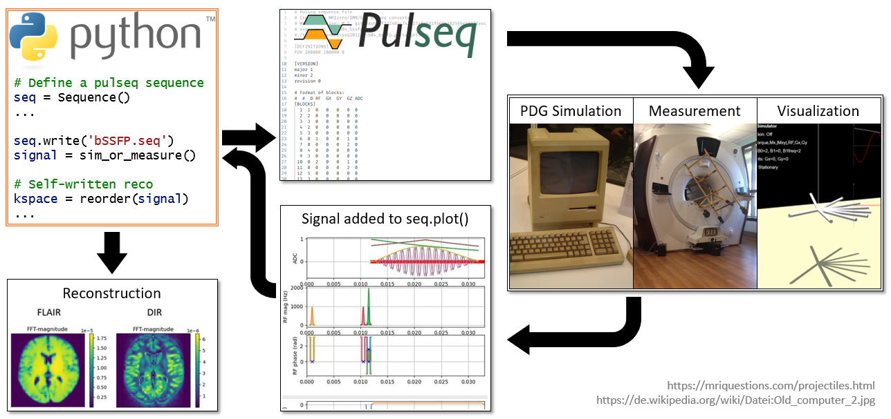

# Pitch

We present an open source hands-on MR sequence programming course based on Pulseq. Pulseq (https://pulseq.github.io/) is a well-suited tool to teach students MR sequence programming, as it is simple, standardized, and vendor agnostic. At the same time, sequences fulfill physical constraints and coded Pulseq files can be executed on any scanner if an interpreter is available. For students it is also very rewarding to conclude a course by being able to measure and reconstruct their own imaging sequences that were executed at a real MRI scanner.

However, teaching MR programming effectively requires immediate feedback to the students from the beginning on, starting with analyzing the signal of the first self-written FID sequence. Getting quick feedback for the first experiments, MRI sequence prototypes or unconventional ideas of a larger group of students requires a fast and universal Bloch simulation. Our course tool (https://github.com/mzaiss/MRTwin_pulseq) completes Pulseq with a fast and accurate Phase Distribution Graph Bloch simulation. This tool can read .seq-files directly and calculate accurate signals of a virtual phantom within seconds, which are added to the ADC plot of Pulseq. Moreover, we extended the famous online Bloch visualization tool www.drcmr.dk/BlochSimulator/ to be able to read in .seq files. Both enables a fast feedback loop directly on the students’ own PC while prototyping a sequence or a reconstruction.

In this setup, simulation and measurement are fully interchangeable. This makes it possible to investigate image artifacts, image contrast weighting, or reconstruction problems early on by using the simulation, before measuring the final MR sequence at the real system. 

# Authors

[CRediT](https://www.elsevier.com/authors/policies-and-guidelines/credit-author-statement)

Moritz Zaiss: Conception, testing and supervision of the exercises, solutions to MR exercise sequences, proof reading
Simon Weinmüller: generation, testing and optimization of measurement loop, proof reading
Hoai Nam Dang: generation, testing and optimization of measurement loop, Phantom generation, proof reading
Jonathan Endres: Simulation, Pulseq interpreter, Phantom generation, proof reading
Zhaoshun Hu: Pulseq interpreter for Bloch-Simulator, proof reading
Lars Hanson: Bloch-Simulator base code, proof reading
